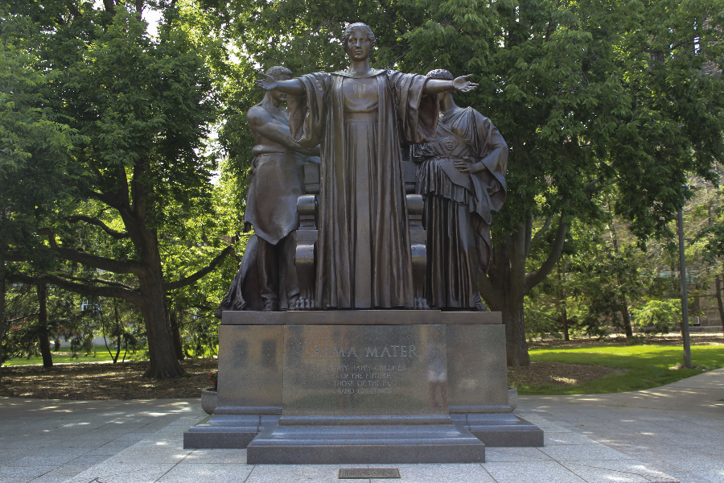
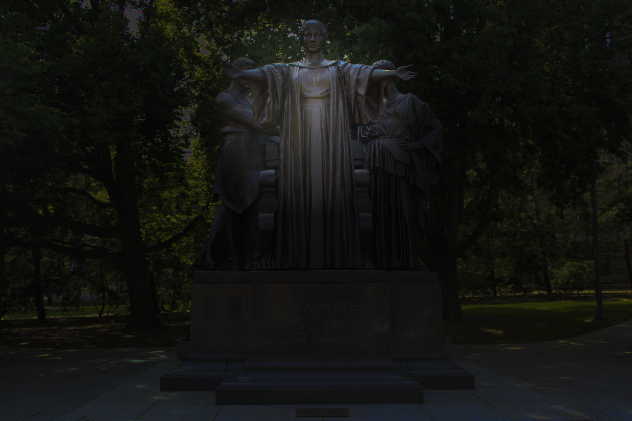
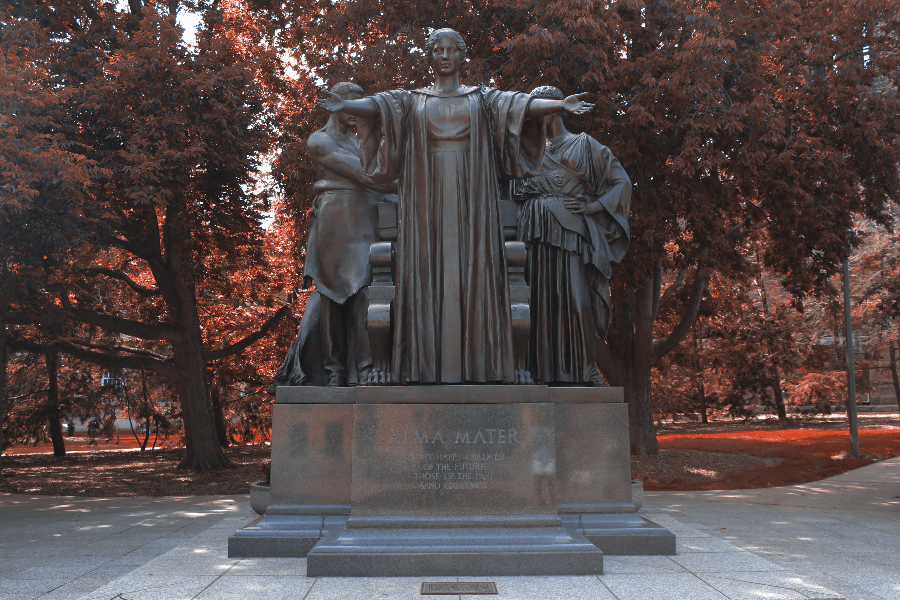

# Image Transformation with C++

The project encodes a PNG image using lodepng, converts RGB to HSL, and employs it to do various transformations such as grayscale, illinify, spotlight, and watermark. (Final project for the Object Oriented DS with C++ course)

# Test image

# Watermarked image

# Greyscaled image

# Spotlighted image

# Illinified image

# Compiling in C++
- It includes a Makefile for creating Imagetransform and test executables.
- Navigate to the folder containing the Makefile and execute the "make" command to create two executables.
- Execute./ImageTransform to generate four PNG images from alma.PNG.
- The mechanism for image transformation is given in ImageTransform. cpp
- Execute "make test" to run the tests described in the test folder on your application. In the main.cpp file, you may change the image name (by default, alma.png) and centre coordinates for the spotlight.

